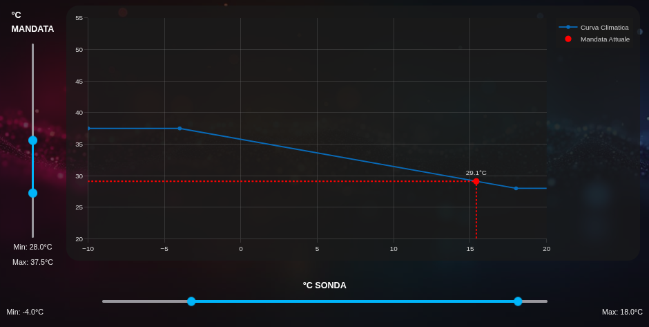
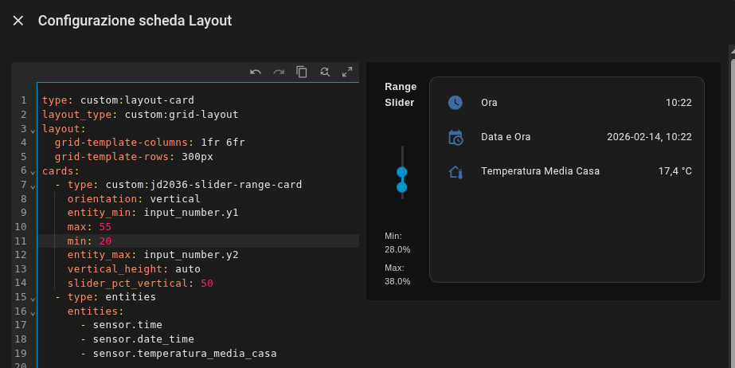
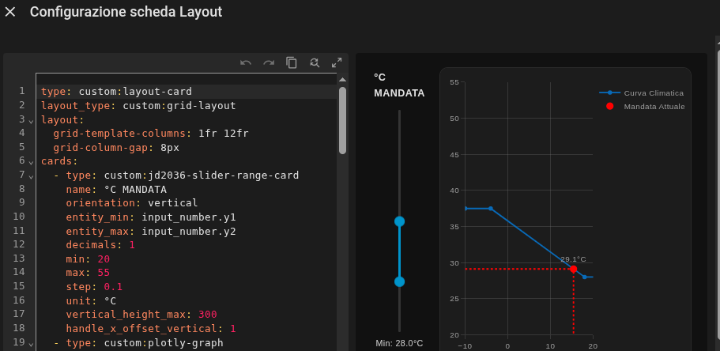
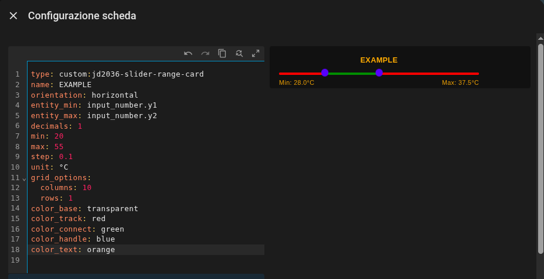

# JD 2036 Slider Range Card

A fully customizable dual-handle range slider for Home Assistant
Lovelace.

Built on top of noUiSlider, this card allows you to control two
`input_number` entities (Min / Max) with a clean, theme-aware and highly
configurable interface.

Supports horizontal and vertical layouts, percent sizing inside the
card, auto vertical height, full color customization and fine handle
alignment.

Provides granular color control for every slider component.
If color options are omitted, the card gracefully falls back to the active Home Assistant theme variables.

------------------------------------------------------------------------

# Preview

## Horizontal (Embedded in Stack)



Works correctly inside:

-   vertical-stack-in-card
-   horizontal-stack
-   layout-card
-   grid layouts

```yaml
type: custom:vertical-stack-in-card
cards:
  - type: custom:jd2036-slider-range-card
    name: Example
    orientation: horizontal
    entity_min: input_number.x1
    entity_max: input_number.x2
    min: -10
    max: 20
    step: 0.1
    unit: °C
```
------------------------------------------------------------------------

## Horizontal (How to use slider_pct_vertical)



Works correctly inside:

-   layout-card
-   grid layouts

```yaml
type: custom:layout-card
layout_type: custom:grid-layout
layout:
  grid-template-columns: 1fr 6fr
  grid-template-rows: 300px
cards:
  - type: custom:jd2036-slider-range-card
    orientation: vertical
    entity_min: input_number.y1
    max: 55
    min: 20
    entity_max: input_number.y2
    vertical_height: auto
    slider_pct_vertical: 50
  - type: entities
    entities:
      - sensor.time
      - sensor.date_time
      - sensor.temperatura_media_casa
```

------------------------------------------------------------------------

## Vertical Example



```yaml
type: custom:jd2036-slider-range-card
name: °C Flow
orientation: vertical
entity_min: input_number.y1
entity_max: input_number.y2
min: 20
max: 55
step: 0.1
unit: °C
vertical_height_max: 300   #required to not stretch out of the card!!! adjust this value
slider_pct_vertical: 80
handle_x_offset_vertical: 6
```

------------------------------------------------------------------------

## Color Customization



All color options support:

-   Hex (#00bcd4)
-   RGB (rgb(0,122,255))
-   RGBA
-   CSS variables (var(--primary-color))

Available color parameters:

-   color_base
-   color_track
-   color_connect
-   color_handle
-   color_text

### Transparent Example

```yaml
type: custom:jd2036-slider-range-card
entity_min: input_number.x1
entity_max: input_number.x2
color_base: transparent
color_track: transparent
color_connect: rgb(0, 122, 255)
color_handle: orange
color_text: red
slider_pct_horizontal: 70
handle_y_offset_horizontal: 2
```

------------------------------------------------------------------------

# Features

-   Dual-handle range slider (Min & Max)
-   Horizontal and Vertical orientation
-   Auto vertical height with safe fallback
-   Adjustable percent sizing inside the card
-   Custom handle dimensions
-   Fine alignment offsets:
    -   handle_y_offset_horizontal
    -   handle_x_offset_vertical
-   Full color customization
-   Works inside stacked cards
-   Smooth visual updates during drag
-   Writes values to Home Assistant on release

------------------------------------------------------------------------

# Installation

## Manual Installation

1.  Copy the file:

/##YOUR_CUSTOM_COMMUNITY_FOLDER##/jd2036-slider-range-card.js


2.  Add resource:

Settings → Dashboards → Resources

URL:

/##YOUR_CUSTOM_COMMUNITY_FOLDER##/jd2036-slider-range-card.js?v=1

Type:

JavaScript Module

3.  Reload browser (clear cache if needed).

------------------------------------------------------------------------

# Configuration Reference

## Required Parameters

  Option       Description
  ------------ -----------------------------
  entity_min   Entity ID for minimum value #(min: in general options)
  entity_max   Entity ID for maximum value #(min: in general options)

------------------------------------------------------------------------

## General Options

  Option        Default          Description
  ------------- ---------------- -------------------------------
  name          "Range Slider"   Card title
  decimals      1                Decimal precision
  orientation   "horizontal"     horizontal or vertical
  min           0                Slider minimum value
  max           100              Slider maximum value
  step          1                Step increment
  unit          \%               Unit displayed next to values
  thickness     4                Slider track thickness (px)

------------------------------------------------------------------------

## Percent Sizing

  -------------------------------------------------------------------------------
  Option                  Range         Default           Description
  ----------------------- ------------- ----------------- -----------------------
  slider_pct_horizontal   1--100        100               Width percentage when
                                                          horizontal

  slider_pct_vertical     1--100        100               Height percentage when
                                                          vertical
  -------------------------------------------------------------------------------

------------------------------------------------------------------------

## Vertical Height Control

  Option                Default   Description
  --------------------- --------- ---------------------------
  vertical_height       "auto"    Fixed height or auto mode
  vertical_height_min   30        Minimum vertical height
  vertical_height_max   1000      Maximum vertical height

------------------------------------------------------------------------

## Handle Customization

### Size

  Option          Default
  --------------- ---------
  handle_width    14
  handle_height   14
  handle_border   2

## Handle orientation-specific overrides:

-   handle_width_horizontal
-   handle_height_horizontal
-   handle_width_vertical
-   handle_height_vertical

------------------------------------------------------------------------

## Handle Offsets

### Horizontal

```yaml
handle_y_offset_horizontal: 2 #pixels up
```

Positive → moves handle down\
Negative → moves handle up

Default: 2px

------------------------------------------------------------------------

### Vertical

```yaml
handle_x_offset_vertical: 2 #pixels to the side 
```

Positive → moves handle right  
Negative → moves handle left

Default: 0px

------------------------------------------------------------------------

# Behavior

-   Values update visually while dragging
-   Values are written to Home Assistant on release
-   Vertical mode uses RTL internally for natural interaction

------------------------------------------------------------------------

# License

This project is licensed under the MIT License.
See the LICENSE file for details.
